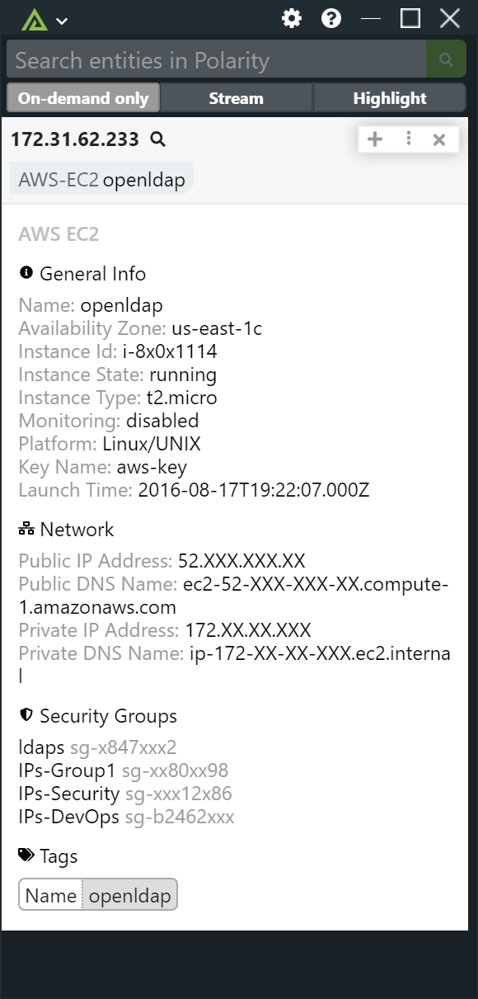

# Polarity AWS EC2 Integration

The Polarity AWS EC2 integration enables querying your ec2 instances by IP and domain. 

The integration will currently search the following fields:

| Entity Type | Fields | Example entity  |
|---|---|---|
| Private IPv4 Address |  private-ip-address | 172.31.61.45 |
| Public IPv4 Address | ip-address | 43.250.192.1 |
| Public Domain | dns-name | ec2-52-200-209-38.compute-1.amazonaws.com |
| Private IP DNS Name | private-dns-name | ip-172-31-61-45.ec2.internal |
| Private IPv6 | network-interface.addresses.private-ip-address | 2a05:d07c:2000:xxxx:xxxx:xxxx:xxxx |
| Public IPv6 | network-interface.ipv6-addresses.ipv6-address | fd8e:a626:878f:6126:xxxx:xxxx:xxxx:xxxx |
| InstanceId | instance-id |  i-1a2b3c4d (8 character version),  i-1234567890abcdef0 (17 character version)|

## AWS EC2

### AWS Region

The AWS Region for the EC2 instances you want to search.

### AWS Access Key Id

The access key ID that identifies the security credentials used to authenticate to the specified EC2 region.  As this integration is designed only for querying your EC2 instances (read-only), we recommend using security credentials tied to an IAM service user with read-only access to EC2. When creating the IAM service user you can assign the `AmazonEC2ReadOnlyAccess` AWS managed policy to enforce this.

### AWS Secret Access Key

The secret access key associated with your Access Key Id that can be used to sign requests.

## Installation Instructions

Installation instructions for integrations are provided on the [PolarityIO GitHub Page](https://polarityio.github.io/).

## Polarity

Polarity is a memory-augmentation platform that improves and accelerates analyst decision making.  For more information about the Polarity platform please see:

https://polarity.io/
